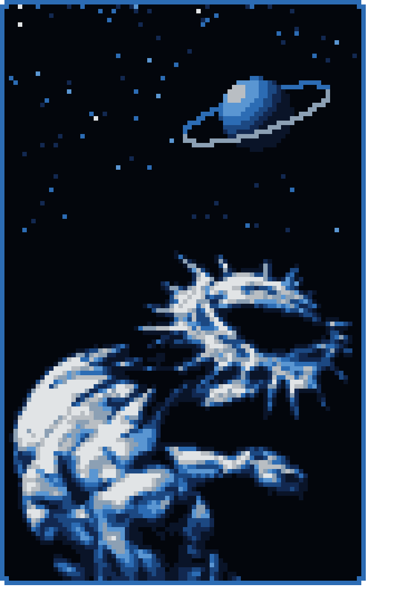

<h1 align="center">Hi, I'm Seia 👋</h1>

  

### 🧠 Building Memora

I lead the full technical vision of our products, including the implementation of **memory graph based contextual AI protocols in reminiscence therapy** in order to mitigate dementia in senior patients at eldercare facilities. I also prototype our physical products and am heavily involved in pilot tests.

Those contributions have helped us raise **¥5M in investment in the last 5 months**.

### 🔬 Machine learning

📝 Writing a paper on how ML principles can **optimize eldercare facility workflows**.

📝 Writing a personal paper on **optimizing open-source models for average consumer hardware**, with a goal of running on **8 GB of VRAM**.

### ⛓️ Web3

I'm just getting started in the world of web3, and I'm planning to attend a **web3 hackathon later this year**!

 
